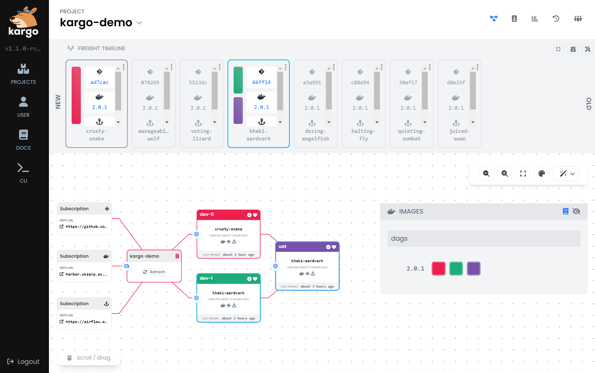

# kargo-pipelines

Reusable deployment chart which clones a deployment across multiple stage environments and wires it up to be controlled through kargo and argo.

Deploy the `example/kargo-demo/kargo-pipeline.yaml` root argo application to create a `kargo-demo` parent namespace along with `kargo-demo-dev-0`, `kargo-demo-dev-1`, and `kargo-demo-uat` deployment namespaces.

Kargo will manage promoting freight onto deployment branches named for their stage such as `deployment/kargo-demo-dev-0`.

In the chart values where you specify the named stages, argo applications will be created by default and kargo pipelines will be created.

By setting `enabled: false` on a stage it will still appear in kargo and have it's deployment branch managed, but no argo app will actually be spawned.

```yaml
# A list of stages to spawn and their dependencies
stages:
  - name: "dev-0"
  - name: "dev-1"
    enabled: false
  - name: "uat"
    enabled: false
    freightFrom:
      - "dev-0"
      - "dev-1"
```



---

Requires argo and kargo creds to be placed on the cluster. These should come from vault in practice.

```yaml
# Argocd git cred
apiVersion: v1
kind: Secret
type: Opaque
metadata:
  name: kargo-demo-argo-repo
  namespace: argocd
  labels:
    argocd.argoproj.io/secret-type: repo
stringData:
  url: https://github.com/SwanseaUniversityMedical/kargo-pipelines.git
  username: example
  password: xxx
---
# Kargo git cred (annoyingly different)
apiVersion: v1
kind: Secret
type: Opaque
metadata:
  name: kargo-demo-kargo-repo
  namespace: kargo-demo
  labels:
    kargo.akuity.io/cred-type: git
stringData:
  repoURL: https://github.com/SwanseaUniversityMedical/kargo-pipelines.git
  username: example
  password: xxx
---
# Kargo oci image cred
apiVersion: v1
kind: Secret
type: Opaque
metadata:
  name: kargo-demo-kargo-registry
  namespace: kargo-demo
  labels:
    kargo.akuity.io/cred-type: image
stringData:
  repoURL: harbor.ukserp.ac.uk/dlm/airflow/dags
  username: example
  password: xxx
```